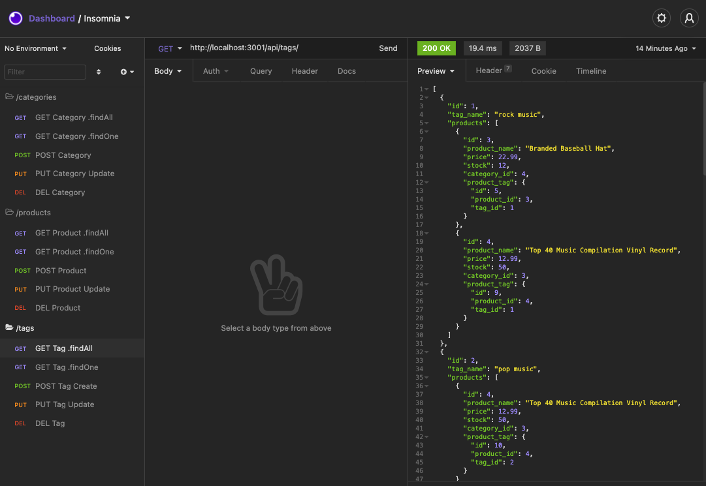

## Description
Create a back end e-commerce site that will take a working Express.js API and configure it to use Seqielize to interext with a MYSQL database.

## Mock Up 

  
The full movie file showing functionality of the application can be found [HERE](https://drive.google.com/file/d/1Mm4vEIL55YrQohMFT5rYWnhV1RIW-hV2/view?usp=sharing)  
## User Story
  
```
AS A manager at an internet retail company
I WANT a back end for my e-commerce website that uses the latest technologies
SO THAT my company can compete with other e-commerce companies
```
  
## Acceptance Criteria
  
``` 
GIVEN a functional Express.js API
WHEN I add my database name, MySQL username, and MySQL password to an environment variable file
THEN I am able to connect to a database using Sequelize
WHEN I enter schema and seed commands
THEN a development database is created and is seeded with test data
WHEN I enter the command to invoke the application
THEN my server is started and the Sequelize models are synced to the MySQL database
WHEN I open API GET routes in Insomnia for categories, products, or tags
THEN the data for each of these routes is displayed in a formatted JSON
WHEN I test API POST, PUT, and DELETE routes in Insomnia
THEN I am able to successfully create, update, and delete data in my database
```
## Installation 
`npm init`

`npm i dotenv`

`npm i express`

`npm i mysql2`

`npm i sequelize`

## Usage
- TERMINAL $mysql -u root -p
- TERMINAL $show databases;
- TERMINAL $create database ecommerce_db;
- TERMINAL $exit 
- TERMINAL $npm start
- TERMINAL displays "Now Listening 3001"


